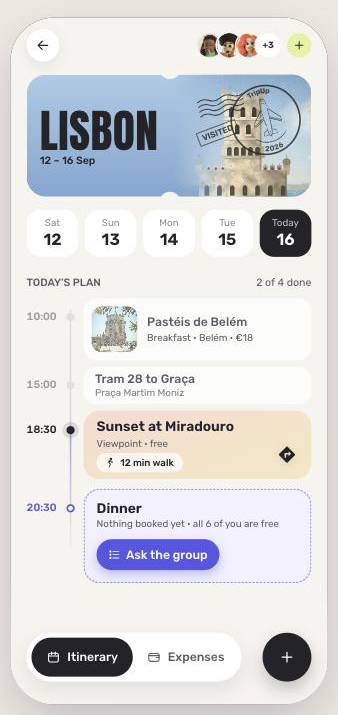
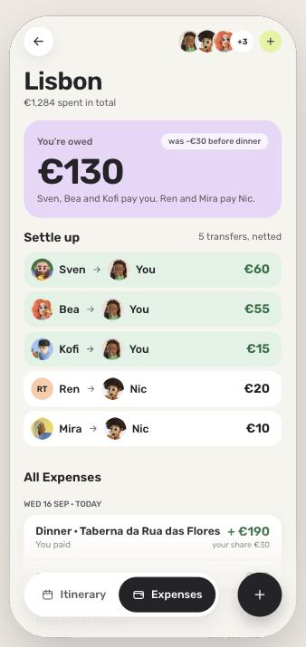

# TripUp

**[Open the prototype →](https://tripup-delight.vercel.app)** · [Figma file](https://www.figma.com/design/qITM47IS3nfWVV3KxyH3pv/TripUp---Bending-Spoons---Delight-Asaph)

A working, mobile-optimised prototype of one end-to-end journey in **TripUp** — an app for
organising group trips: friends plan the itinerary together, decide with quick polls instead of
long group chats, log shared expenses and settle up.

The scenario is the last evening of a trip to Lisbon. Ari adds a friend who's joining for dinner,
polls three restaurants, watches the votes land live, puts the winner on the itinerary, splits the
bill by item, nets the debts, and squares the trip up.

Real code, real state, real arithmetic — not a click-through. The poll counts actual votes, the
bill is split from actual line items, and the transfers are the result of actually netting seven
people's balances.

Start on Home and follow it through to "Lisbon is squared up" — about two minutes.

<p align="center">
  
  
</p>

## The device

One reference phone: **iPhone 14, 390 × 844 pt, never scaled.** On a desktop browser the app
renders inside a centred device frame; on a phone-sized viewport it fills the screen.

There is no drawn status bar and no home indicator. The design file includes both, but neither
tells anyone anything the real OS isn't already showing, and together they cost about 60 pt of a
844 pt screen. That space goes to the content instead.

## Routes

Every screen has a real URL, so any point in the journey can be shared or reloaded.

| Path | Screen |
| --- | --- |
| `/` | Home |
| `/trip` · `/trip/expenses` | Trip — itinerary and expenses |
| `/trip/buddies` · `/trip/buddies/add` | Who's on the trip; adding someone |
| `/trip/add` | Quick add |
| `/poll/new` → `/poll/places` | Making a poll: the question, then the options |
| `/poll/live` | The poll while it's running |
| `/poll/alert` · `/poll/vote` | The same poll on another person's phone |
| `/expenses/new` → `/expenses/new/items` | Logging the dinner, split by item |
| `/expenses/add` | Logging an expense with nothing to link it to |
| `/expenses/:id` | One expense, in detail |
| `/notifications` | Notifications |
| `/settle` | Paying someone back |
| `/squared-up` | The trip, squared up |

Two routes are internal rather than part of the app: `/screens` lists every screen in flow order,
and `/styleguide` is a proof sheet for every design token. If something looks wrong on the style
guide, the token is wrong.

## Demoing it

A **Demo** panel sits outside the phone frame. It can switch whose phone you're looking at, jump
to any screen, change the speed of the simulated real-time events, and reset. The state is shared
between people: a vote cast on one phone shows up on another.

The simulated events are real timers, not scripted screens — send the poll and the other votes
arrive over about six seconds, leaving one person to nudge.

## Run it

```bash
npm install
npm run dev
```

Then open <http://localhost:5173>.

| Script | What it does |
| --- | --- |
| `npm run dev` | Dev server |
| `npm run build` | Typecheck + production build |
| `npm run preview` | Serve the production build |
| `npm run lint` | Lint |
| `npm test` | Unit tests (netting, splitting, poll rules) |

## Layout

```
docs/            PRODUCT_SPEC.md and DESIGN_SYSTEM.md — the source of truth for behaviour and visuals
docs/screens/    one build note per screen: exact geometry, colours, and the decisions behind them
src/domain/      netting, split-by-item and poll rules — pure functions, unit-tested
src/store/       the trip's state, and the simulated real-time events
src/screens/     one file per screen, plus the route registry
src/components/  shared UI
src/data/        the mock trip
src/styles/      tokens.css (the design system as CSS variables) and the motion tokens
public/assets/   avatars, place photos, stamps and icons
design/screens/  reference renders from the design file, at 390 × 844
design/readme/   the screenshots above
```

## Where the logic lives

Anything with a number in it is in `src/domain/` and covered by tests:

- **`netting.ts`** — turns seven balances into the fewest transfers that settle them.
- **`split.ts`** — splits a bill evenly or by item, where each item can be shared by a different
  subset of the group. Remainders are distributed a cent at a time, so shares always sum back to
  the exact total.
- **`poll.ts`** — tallying, ties (broken by earliest vote) and when a poll may close.

Every per-person amount on screen is computed from these. Nothing is typed in by hand, which is why
the expenses that *aren't* shared by everyone — the surf lesson that four people went on, the taxi
three of them took — need no special case.

## Design

Rubik (400/500/600) for the UI, Anton (400) for the destination on the ticket and the stamp titles.
Colour, type, spacing, radii, elevation and motion are all tokens in `src/styles/tokens.css`,
documented in `docs/DESIGN_SYSTEM.md`.

Avatars are from the Material 3 3D avatar kit; place photos are stand-ins.
